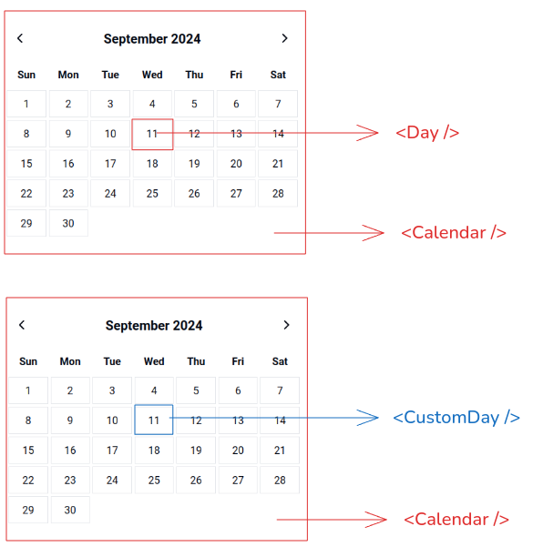
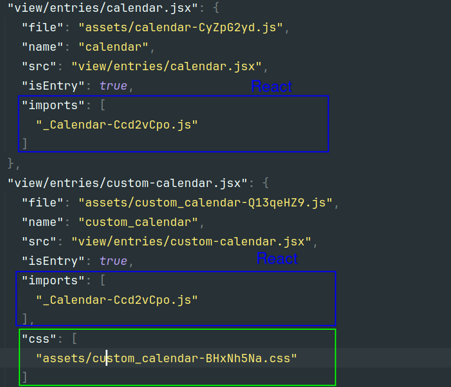

# PHP + [REACT + VITE]

The biggest advantage of React is the reusability of the components, let's see an example of how to implement it with PHP, the first thing to take into account is that we don't need to make the whole interface with React, just use it for the components that require it. 

Unlike the traditional approach where the whole interface is created with React, we will see how to complement the PHP view with reusable components, in this example we will see a calendar with two different implementations of the `<Day />` component.



The simplest and most recommended way to start a `PHP + React` project is to use [Vite](https://vitejs.dev/)

```bash
pnpm create vite php-react --template react
```

As this is an integration with a backend language we have to define the inputs manually as it cannot infer them from the `index.html`, Vite has a section in the [documentation](https://vitejs.dev/guide/backend-integration.html) for these cases. 

```js
export default defineConfig({
    plugins: [react()],
    publicDir: false,
    build: {
        outDir: 'public/dist',
        emptyOutDir: true,
        manifest: true,
        rollupOptions: {
            input: 'view/main.jsx',
        }
    }
})
```
> **Important:**  
> - `publicDir: false:` It is set to false as we will use the public as the entry point of our PHP app.

Unlike traditional uses where there is only one entry point to process by Vite, here we want to use the components individually, only in the views where we need them,
we need to modify input entries to register each one in `vite.confi.js`

```
...
input: {
    calendar: 'view/entries/calendar.jsx', 
    datatable: 'view/entries/datatable.jsx'
    ...
}
```

## Vite 



Vite is very efficient when creating the assets,
if two or more components share common libraries it creates a new file 
and adds it as imports avoiding redundant loading,
this allows us to use N components without increasing the size of the files.

It is sufficient to use only the component 
script as the dependency loading is included in the script.

### CSS

This is not the case with style files, which must be loaded using the manifest,

The good news is that no matter how many style files are imported into the Vite module it will create only one. 

## Dev `vs` Build

Here comes the interesting part, when we are working in development mode vite serves the changes using hot reloading which is very different from the static way in which we include the files already built in production.

As we are not using the same Vite http server for rendering but the PHP one we must use the vite host to include scripts.
```js
<!-- if development -->
<script type="module" src="http://localhost:5173/calendar.jsx"></script>
```
and for the specific case of React we need to include react-refresh

```js
<script type="module">
  import RefreshRuntime from 'http://localhost:5173/@react-refresh'
  RefreshRuntime.injectIntoGlobalHook(window)
  window.$RefreshReg$ = () => {}
  window.$RefreshSig$ = () => (type) => type
  window.__vite_plugin_react_preamble_installed__ = true
</script>
```
But this can be easily solved using PHP to have a single version to include the scripts,
with the help of the Vite manifest.


> This is a proof of concept, you can see the helper class ViteComponentLoader
```php
<!-- head styles -->
<?php if($vite->isProd()): ?>
    <link rel="stylesheet" href="<?php $vite->styles('calendar') ?>">
<?php endif; ?>

.....

<!-- body scripts -->
<?php 
 # Only works if Dev server is running  
 echo $vite->addReactRefresh();
?>

<?php if($vite->isProd()): ?>
    <script type="module" src="<?php $vite->component('calendar') ?>"></script>
<?php endif; ?>
```


